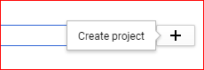
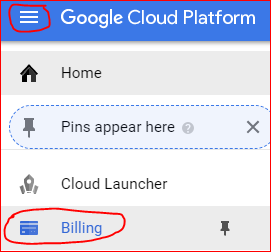
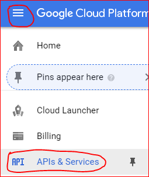
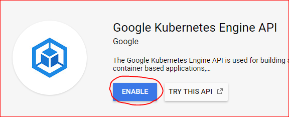
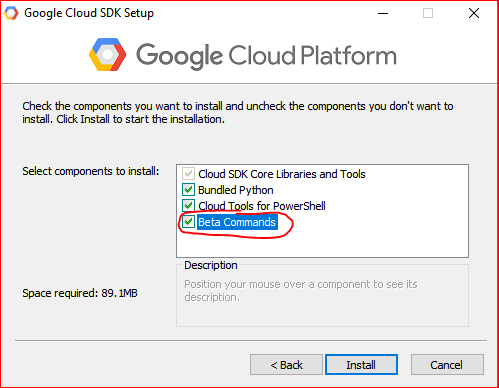

Installation
============

In the following, we will be walking through the requirements to get you setup with tensorforce-client
and how to satisfy or install each one of them.

Your Google Account
-------------------

Create a new google account or use an existing one.
Then go to http://console.cloud.google.com and create a new cloud project:

    Click here ...

Enter a project name (only using alphanumeric or hyphens), for example:
"TensorForce-Client". Select this project to be your active project
from here on.

    ... enter a name and click there.

Next, you will have to enable billing by providing Google with a
(non-prepaid) credit card or a bank account number. This is necessary
in order for Google to charge you for your future accrued
cloud computing costs.

    How to get to "Manage your billing account".

Then go to "APIs and Services" from the main menu (see image below) ...

    How to get to "APIs and Services".

... and activate the following APIs (some of which may have
already be enabled by default):

- Google Compute Engine API
- Google Kubernetes Engine API
- Google Cloud Storage
- Google Container Registry API
- Cloud Container Builder API

    Enabling the Kubernetes Engine API.

Get the Google Cloud SDK (all platforms)
----------------------------------------

Go to the following URL and download the google SDK executable for your platform:

https://cloud.google.com/sdk/docs/quickstarts

Run the executable and follow the installation instructions.

Make sure you enable beta commands during installation as sometimes
the tensorforce-client will rely on those.

    Enable beta SDK commands during the google SDK installation procedure.

At the end of the installation process, depending on the installer
version, say 'yes' to setting up the
command line client (`gcloud`) or make sure that `gcloud init`
runs. This will conveniently point you to your google account
and (newly created) google cloud project and set some useful defaults
(default compute region and zone).

There is a shell that comes with the installation. However, in order
to run the tensorforce-client from within any shell (anaconda, git,
or vanilla PowerShell), simply make sure that the gcloud
installation path + `/bin` is part of the %PATH env variable.

To make sure everything is setup correctly, run a test gcloud
command. The output should look somewhat liks this:

.. code:: bash

    $ gcloud version
    Google Cloud SDK 187.0.0
    alpha 2017.09.15
    beta 2017.09.15
    bq 2.0.28
    core 2018.01.28
    gsutil 4.28

Install Python3.5 or higher
---------------------------

... if you haven't already done so a long time ago ;-)

Get the TensorForce Client
--------------------------

The tensorforce-client is a python module that can be installed in
one of two ways:

1) The easy way: pip Installation
+++++++++++++++++++++++++++++++++

Installing tensorforce-client through pip:

.. code:: bash

    $ pip install tensorforce-client

Note: tensorforce-client neither needs the tensorforce library itself
nor any of its core dependencies (e.g. tensorflow or tensorflow-gpu).
So this should be an easy ride.
Exception: If you would like to view (offline) tensorboard summaries of your models to be able to understand
how well the algorithm is learning or to debug your models, you will have to install tensorflow like so:

.. code:: bash

    $ pip install tensorflow

2) The hard way: git clone + setup.py
+++++++++++++++++++++++++++++++++++++

You can also get the latest development version of tensorforce-client
by cloning/pulling it directly from our github repo and then
running setup.py:

.. code:: bash

    $ git clone github.com/reinforceio/tensorforce-client
    $ cd tensorforce-client
    $ python setup.py

Set an alias
------------

Tensorforce-Client is a python module that should be run using:

.. code:: bash

    $ python -m tensorforce_client [some command(s)]

You can set an alias (e.g. `tfcli`) in your current session
for this as follows:

- Windows:

.. code:: bash

    $ doskey tfcli=python -m tensorforce_client $*

- Linux:

.. code:: bash

    $ alias tfcli='python -m tensorforce_client'

